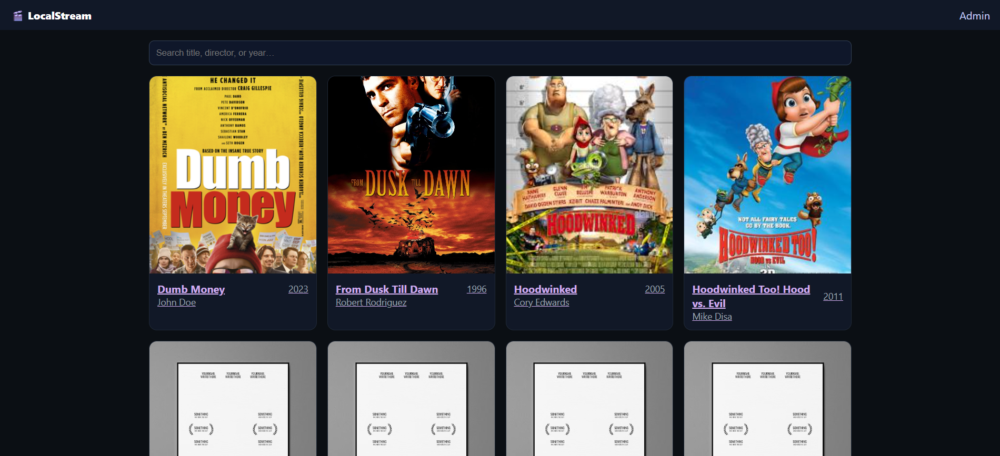
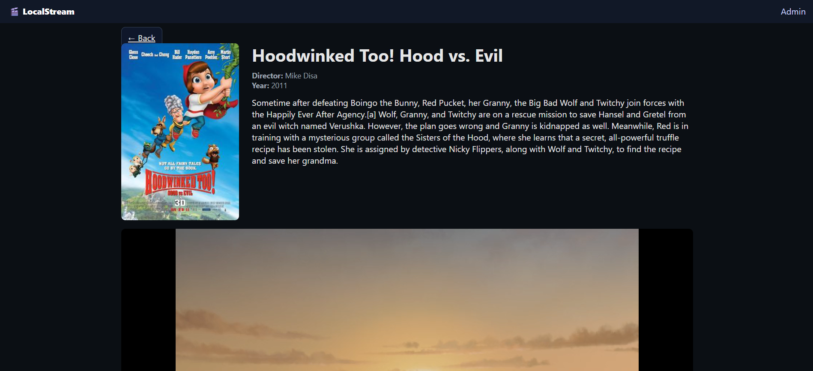

# 🎬 لوکال استریم

نرم‌افزاری برای به اشتراک گذاری فیلم و سریال در شبکه‌ی خانگی، ساخته شده با **Go + Gin** در بک‌اند و **React** در فرانت‌اند.  
این پروژه امکان نمایش، جستجو و مشاهده جزئیات فیلم‌ها را فراهم می‌کند و می‌تواند به راحتی روی سیستم شخصی یا سرور محلی اجرا شود.

## ✨ ویژگی‌ها

- 📂 **بک‌اند سریع و سبک** با فریم‌ورک Gin در زبان Go
- 🎨 **فرانت‌اند مدرن** با React و React Router
- 🖼 نمایش پوستر فیلم‌ها و تصویر پیش‌فرض در صورت نبود پوستر
- 🔍 امکان جستجو و فیلتر کردن فیلم‌ها
- 📱 طراحی ریسپانسیو برای موبایل و دسکتاپ

## 🛠 تکنولوژی‌های مورد استفاده

### Backend
- [Go](https://go.dev/)
- [Gin](https://gin-gonic.com/)
- [GORM](https://github.com/go-gorm/gorm)
- [SQLITE](https://sqlite.org/)

### Frontend
- [React](https://react.dev/)
- [React Router](https://reactrouter.com/)
- [TypeScript](https://www.typescriptlang.org/)

## 📦 نصب و اجرا

### 1. کلون کردن پروژه
```bash
git clone https://github.com/username/localstream.git
cd localstream
````

### 2. راه‌اندازی Backend
> برای تنظیم مسیر دایرکتوری فیلم‌های خود فایل `config.json` را قبل از اجرای سرور ویرایش کنید.

```bash
go mod tidy
go run main.go
```

> 
> به صورت پیش‌فرض بک‌اند روی `http://localhost:8080` اجرا می‌شود.

### 3. راه‌اندازی Frontend (حالت توسعه)

```bash
cd frontend
npm install
npm start
```

> حالت توسعه فرانت‌اند روی `http://localhost:3000` اجرا می‌شود.

## 🚀 بیلد و استقرار

برای استفاده از فرانت‌اند در Gin، ابتدا باید بیلد بگیرید:

```bash
cd frontend
npm run build
```

سپس Gin به صورت خودکار فایل‌های بیلد شده در مسیر `/frontend/dist` را سرو می‌کند:

```go
// main.go
router.Static("/app", "./frontend/dist")

router.NoRoute(func(c *gin.Context) {
    if strings.HasPrefix(c.Request.URL.Path, "/app") {
        c.File("./frontend/dist/index.html")
        return
    }
    c.String(http.StatusNotFound, "Not Found")
})
```

## 📡 API‌ها

### دریافت لیست فیلم‌ها

```
GET /api/v1/movies
```
**پاسخ نمونه:**

```json
{
  "movies": [
    {
      "ID": 1,
      "Title": "Dumb Money",
      "Year": 2023,
      "Director": "Craig Gillespie",
      "Summary": "A true story...",
      "PosterPath": "posters/Dumb_money_poster.png"
    }
  ]
}
```

### دریافت جزئیات یک فیلم

```
GET /api/v1/movies/:id
```
### تغییر متادیتای یک فیلم
```
PUT /api/v1/movies/:id
```
### آپلود کردن پوستر یک فیلم
```
POST /api/v1/movies/:id/poster
```

## 📷 تصاویر نمونه

### صفحه اصلی



### صفحه جزئیات فیلم




## 📜 لایسنس

این پروژه تحت لایسنس MIT منتشر شده است.
آزاد هستید آن را تغییر داده و استفاده کنید.
